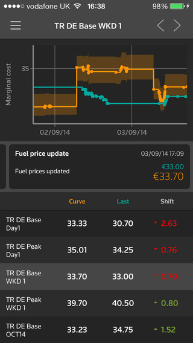
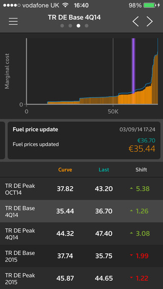
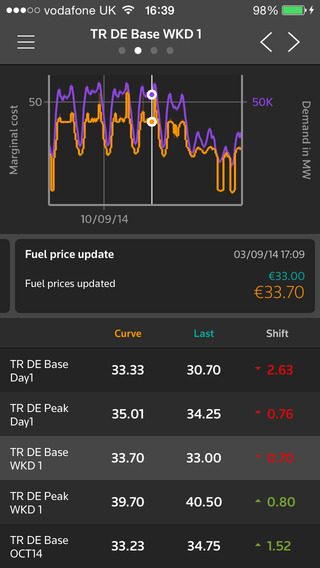

#TRCharts

The TRCharts library provides interactive OpenGL charts for Android and iOS applications, using a common C++ codebase and autogenerated bindings to Java/JNI and Objective-C.

One of the project goals is that library development and use feels idiomatic to C++, Java, and Objective-C developers.

Check the [Wiki](https://github.com/thomsonreuters/TRCharts/wiki) for information about configuration of the sample sandbox apps, and how you can contribute to the project.


Copyright 2013 Thomson Reuters


Copyright 2013 Thomson Reuters


Copyright 2013 Thomson Reuters

##Chart components

###Chart
Top level container, holds all other components.

###Axes
Axes are used to define the data co-ordinate system. The following properties may be configured.

* Main line
* Grid lines
* Ticks
* Tick label font and color
* Main label

###Series
Each series must be associated with an abscissa (independent) and ordinate (dependent) axis. These conceptual axis are conventionally mapped to X and Y respectively, but this can be controlled by positioning the axes within the chart. (However the axes pair associated with a given series must be perpendicular).

The series and its axes must be added to the same chart in order for it to be drawn properly.
Axis

The API currently provides continuous series only. Every continuous series type has a datum type; the datum type always implies the type of the ordinate (dependent) variable. Each series has an associated datasource, which provides data of the type expected by the series.

The following series types are supported:

* __Point (Scalar datum)__

  Each datum is drawn as a point with a configurable size.

* __Line (Scalar datum)__

  A line is drawn between each datum with a configurable width.

* __Stepped line (Scalar datum)__

  A horizontal line is drawn between each datum pair, connected to the later datum with a vertical line.
 
* __Band (Range datum)__

  A filled area is drawn between the min and max of each datum respectively.

* __Stepped band (Range datum)__

  A horizontal filled area is drawn between the min and max of each datum pair respectively, connected to the later pair with a vertical line.

* __Area (Scalar datum)__

  As line series, but the area between zero and the line is filled.

* __Stepped area (Scalar datum)__

  As stepped line series, but the area between zero and the line is filled.

Series should be combined to create effects such as a line series with visible points. Multiple series can share the same datasource, as long as the datum type is the same.

###Decorations
Decorations are visual elements that may be tied to a specified data position. Currently only a small set of decorations are provided (infinite lines and points).

##Other features

###Interactivity
The charts can be panned and zoomed (pinched). See the sandbox projects for the platform-specific code.

##Examples
The following examples serve to show how a chart might be configured. (To see how charts are actually drawn on the given platform, see the sandbox projects.)

###Configuring a chart using Java (Android)
```java
// A datasource that returns points from the sine function
public class SineDataSource implements ContinuousDataSource<ScalarDatum>
{
  private final int points;
  private final double step;

  public SineDataSource(final int points, final double step)
  {
    this.points = points;
    this.step = step;
  }

  @Override
  public IndexRange getDatumRange(final ContinuousSeries<ScalarDatum> series)
  {
    return new IndexRange(0, points);
  }

  @Override
  public List<ScalarDatum> getDatums(final ContinuousSeries<ScalarDatum> series, final IndexRange range)
  {
    final List<ScalarDatum> result = new ArrayList<ScalarDatum>();
    for (long i = range.getBegin(); i != range.getEnd(); ++i) {
      final double abscissa = step * i;
      final double ordinate = Math.sin(abscissa);
      result.add(new ScalarDatum(abscissa, ordinate));
    }
    return result;
  }
}

// ... In another class

// Configure a chart
private Chart createChart()
{
  final Chart chart = new Chart();
  chart.setBackgroundColor(new Color(50, 50, 50, 255));
  chart.setMargin(new Margin(50, 50, 10, 50));
  final NumberAxis leftAxis = createAxis(Edge.LEFT);
  chart.addAxis(leftAxis);
  final NumberAxis bottomAxis = createAxis(Edge.BOTTOM);
  chart.addAxis(bottomAxis);
  final LineSeries series = createLineSeries(new SineDataSource(1000, 0.1), bottomAxis, leftAxis);
  chart.addSeries(series);
  return chart;
}

// Create a series with the provided datasource, associated with the provided axes
private LineSeries createLineSeries(final ContinuousDataSource<ScalarDatum> datasource, final ContinuousAxis abscissaAxis, final ContinuousAxis ordinateAxis)
{
  final LineSeries series = new LineSeries();
  series.setDataSource(datasource);
  series.setOrdinateAxis(ordinateAxis);
  series.setAbscissaAxis(abscissaAxis);
  series.setColor(new Color(255, 0, 0, 255));
  series.setLineStyle(new LineStyle(5, LineMode.SOLID));
  return series;
}

// Create an axis associated with the given edge
private NumberAxis createAxis(final Edge edge)
{
  final NumberAxis axis = new NumberAxis();
  axis.setEdge(edge);
  axis.setAxisColor(new Color(255, 255, 255, 255));
  axis.setGridVisible(true);
  axis.setGridColor(new Color(255, 255, 255, 10));
  axis.setTickColor(new Color(255, 255, 255, 10));
  axis.setGridLineStyle(new LineStyle(1.0, LineMode.SOLID));
  axis.setTickLineStyle(new LineStyle(2.0, LineMode.SOLID));
  axis.setTickSize(5.0);
  axis.setAxisLineStyle(new LineStyle(5.0, LineMode.SOLID));
  axis.setTickLabelFont(new Font("DEFAULT", 16, FontHint.ACCURATE));
  axis.setTickLabelColor(new Color(255, 255, 255, 255));
  final AutomaticNumberTickCalculator tickCalculator = new AutomaticNumberTickCalculator();
  tickCalculator.setTargetScreenInterval(50);
  axis.setTickCalculator(tickCalculator);
  final BasicNumberFormatter numberFormatter = new BasicNumberFormatter();
  axis.setTickFormatter(numberFormatter);
  return axis;
}
```

###Configuring a chart using Objective-C (iOS)

```objective-c
// A datasource that returns points from the sine function

@interface SineDatasource : NSObject<TRContinuousDataSource>

@property int points;
@property double step;

-(SineDatasource*)initWithPoints:(int)points step:(double)step;

-(TRIndexRange *)getDatumRange:(TRContinuousSeries *)series;

-(NSArray *)getDatums:(TRContinuousSeries *)series range:(TRIndexRange *)range;

@end

@implementation SineDatasource

-(SineDatasource*)initWithPoints:(int)points step:(double)step
{
    self = [super init];
    if(self) {
        self.points = points;
        self.step = step;
    }
    return self;
}


-(TRIndexRange *)getDatumRange:(TRContinuousSeries *)series
{
    return [TRIndexRange begin:0 end:self.points];
}

-(NSArray *)getDatums:(TRContinuousSeries *)series range:(TRIndexRange *)range
{
    NSMutableArray * result = [[NSMutableArray alloc] init];
    for(long i = [range begin]; i != [range end]; ++i) {
        const double abscissa = self.step * i;
        const double ordinate = sin(abscissa);
        [result addObject:[TRScalarDatum abscissa:abscissa ordinate:ordinate]];
    }
    return result;
}

@end

// ... In another class

// Configure a chart
-(TRChart*)createChart
{
    TRChart * const chart = [[TRChart alloc] init];
    [chart setBackgroundColor:[TRColor red:50 green:50 blue:50 alpha:255]];
    [chart setMargin:[TRMargin left:50 right:50 bottom:50 top:50]];
    TRNumberAxis * const leftAxis = [self createAxisWithEdge:TR_EDGE_LEFT];
    [chart addAxis:leftAxis];
    TRNumberAxis * const bottomAxis = [self createAxisWithEdge:TR_EDGE_BOTTOM];
    [chart addAxis:bottomAxis];
    TRLineSeries * const series = [self createLineSeriesWithDatasource:[[SineDatasource alloc] initWithPoints:1000 step:0.1] abscissaAxis:bottomAxis ordinateAxis:leftAxis];
    [chart addSeries:series];
    return chart;
}

// Create a series with the provided datasource, associated with the provided axes
-(TRLineSeries*)createLineSeriesWithDatasource:(id<TRContinuousDataSource>)datasource abscissaAxis:(TRContinuousAxis*)abscissaAxis ordinateAxis:(TRContinuousAxis*)ordinateAxis
{
    TRLineSeries * const series = [[TRLineSeries alloc] init];
    [series setDataSource:datasource];
    [series setOrdinateAxis:ordinateAxis];
    [series setAbscissaAxis:abscissaAxis];
    [series setColor:[TRColor red:255 green:0 blue:0 alpha:255]];
    [series setLineStyle:[TRLineStyle thickness:5 mode:TR_LINEMODE_SOLID]];
    return series;
}

// Create an axis associated with the given edge
-(TRNumberAxis*) createAxisWithEdge:(TREdge)edge
{
    TRNumberAxis * const axis = [[TRNumberAxis alloc] init];
    [axis setEdge:edge];
    [axis setAxisColor:[TRColor red:255 green:255 blue:255 alpha:255]];
    [axis setGridVisible:YES];
    [axis setGridColor:[TRColor red:255 green:255 blue:255 alpha:10]];
    [axis setTickColor:[TRColor red:255 green:255 blue:255 alpha:10]];
    [axis setGridLineStyle:[TRLineStyle thickness:1.0 mode:TR_LINEMODE_SOLID]];
    [axis setTickLineStyle:[TRLineStyle thickness:2.0 mode:TR_LINEMODE_SOLID]];
    [axis setTickSize:5.0];
    [axis setAxisLineStyle:[TRLineStyle thickness:5.0 mode:TR_LINEMODE_SOLID]];
    [axis setTickLabelFont:[TRFont name:@"DEFAULT" size:16 hint:TR_FONTHINT_ACCURATE]];
    [axis setTickLabelColor:[TRColor red:255 green:255 blue:255 alpha:255]];
    TRAutomaticNumberTickCalculator * const tickCalculator = [[TRAutomaticNumberTickCalculator alloc] init];
    [tickCalculator setTargetScreenInterval:50];
    [axis setTickCalculator:tickCalculator];
    TRBasicNumberFormatter * const numberFormatter = [[TRBasicNumberFormatter alloc] init];
    [axis setTickFormatter:numberFormatter];
    return axis;

}
```

#Project structure

See the [Wiki](https://github.com/thomsonreuters/TRCharts/wiki).

#Todos

See [How can I collaborate](https://github.com/thomsonreuters/TRCharts/wiki/How-can-I-collaborate) in the Wiki.


#Implementation details

##Code generation
The library is composed of multiple layers, an implementation layer built in C++, and generated interface layers for iOS/Objective-C and Java/Android (via JNI). The code generation is controlled by an XML API definition file.

###Definable types

Within the XML API definition file, the following top-level types can be defined. Each top-level type is handled differently during marshalling between the host layer and the implementation layer.

* __Enum__

  Defines an enumerated value. It is always copied between layers.

* __Struct__

  Defines a data-only type (Simple object with fields only and no identity). It is always copied between layers. Static methods may be defined and are implemented in the native layer.

* __Interface__

  Defines a callback or set or related callbacks (code implemented in the host language, but invoked from the native layer). Only methods may be defined. In Objective-C a protocol is created, in Java an interface is created, and in C++ a pure-virtual class is created.

* __Class__

  Defines a native-implemented object. Fields and methods may be declared. (Overriding methods in a class will not provide the desired behavior; overridable characteristics must be realized using interfaces.) A class may implement an interface, this means that a native implementation can be provided for something that can otherwise be implemented in the host language.

* __Template class/Template interface__

  It is possible to use type-parameters on classes and interfaces. However, the use of templates involves slightly more complex marshaling code (specifically, a parameterized marshaler must be constructed for each referenced template type combination). Template types are erased completely in generated Objective-C code, but some additional runtime type safety is provided automatically at the marshaling layer. 

* __Package-level fields and methods__

  Methods may be defined at the package level, these are made available in Java and ObjC using a class with only static methods and a non-invokable constructor.

* __Primitive types__

  The following built in types are available. They are always copied by value: Boolean, Integer (long), Number (double), String (standard library).

* __List type__

  A templated list type is available (copied by value). It is realized as an std::vector&lt;T> in C++, a java.List&lt;T> in Java, and an NSMutableArray in ObjC.

###Object lifetime
The lifetime of objects in the host and native layers are managed such that garbage collection/reference counting in the host language are unified with C++ shared ownership semantics. In short, a class instance can only be created in the host layer and is only destroyed in the native layer when it ceases to be reachable in both layers.

This is implemented as follows:

* An object is created in the host language (Java: new, ObjC: alloc + init)
  * A C++ object is created (this backs the host object).
  * A handle is created with:
     * A weak pointer to the host object
     * A raw pointer to the C++ object
     * An empty native weak pointer
  * A pointer to the handle is set on both the host and native objects.
* The C++ layer references the object (via a call from the host language)
  * A shared pointer is requested from the handle:
  * If the native weak pointer is lockable, lock it and return that
  * Otherwise, strongly reference the host object (because the C++ layer now references it)
  * Create a shared pointer to the native object, with a custom deleter which will:
     * Remove the strong reference the host object
     * __Not__ delete the native object, this means it can fall out of C++ scope without being reclaimed
* The object falls out of C++ scope
  * The custom deleter causes the strong ref to the host object to be dropped (this could cause it to fall out of host scope)
* The object falls out of host scope (Java: finalize, ObjC: dealloc)
  * The handle and the native C++ object are deleted

Importantly, the object is kept alive until it has fallen out of both scopes; if the shared pointer does fall out of C++ scope and then the object needs to be referenced again within C++, another shared pointer will be created to the same instance (but only one shared pointer "group" will exist at any time).

The lifetime within the C++ scope is controlled by the lifetime in the host scope, with GC in Java and ARC reference counting providing the host semantics for reclaim eligibility.

Because of the requirement within Java to use finalization only for memory reclaim, the destructors for public classes in the C++ library cannot be used for anything other than memory reclaim. Also, all caveats applying to finalizers apply here; with the most significant being that OpenGL object starvation is not considered a deciding factor for garbage collection. The finalization issues could be resolved using the same approach used in the Java2D/AWT disposer thread.


### Threading
A given set of co-referenced objects can only be accessed safely from the same thread at any time. It is okay to create objects on one thread and render them on another, as long as there is never an overlap in the execution of those threads.

The library creates no threads, and makes no other general assumptions about threads. (However, in the Java/JNI environment, a global mutex is used to enforce the above rule, this is necessary due to uncertainty regarding the thread in which finalization occurs.)

The interactivity of the charts library is provided by an update/render loop. The host must call the update method on a chart object; a true return value indicates that something has changed and that render should be called. If the host can predict when the chart will change (e.g. when a user interaction has taken place or a datasource has changed), then the host can call update & render until update returns false and then wait until the next probable change event occurs; that is, no event can occur spontaneously within the chart library. 

###Support library
There is a small, hand-written C++ and Objective C support library that provides the BaseObject class, and common marshaling code. This is shared between all codegen projects.

For the Java/JNI environment, there is no support library; this is an omission (more focus was put on the ObjC environment). In this case, the ‘common’ definitions are generated for every codegen project in a unique package.

##Contact
Matt Evans - General, OpenGL, Codegen - matt@arcneon.com

Francisco Estevez - Gobernance, Android - francisco.estevezgarcia@thomsonreuters.com

Martin Lloyd - iOS - martin.lloyd@thomsonreuters.com

Francisco M. Pereira - iOS - francisco.pereira@thomsonreuters.com

##License
Copyright 2015 Thomson Reuters

The Apache Software License, Version 2.0

See LICENSE.md